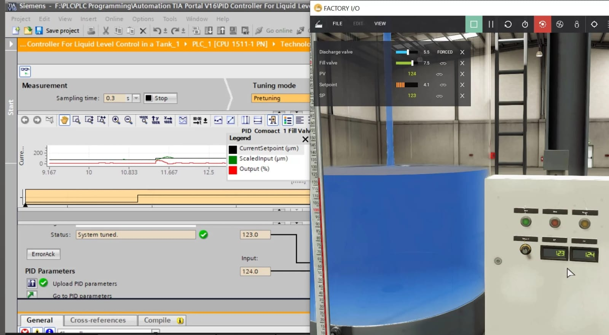
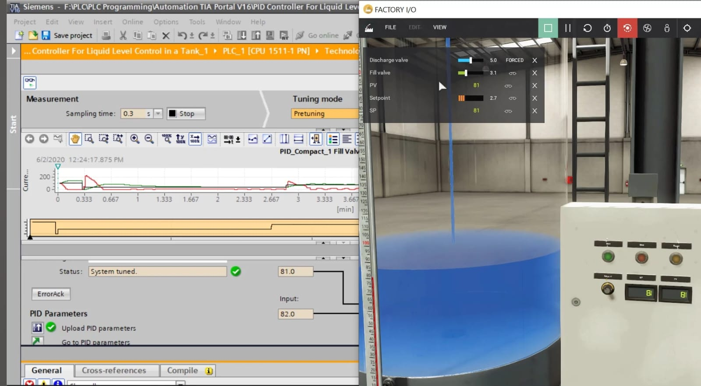
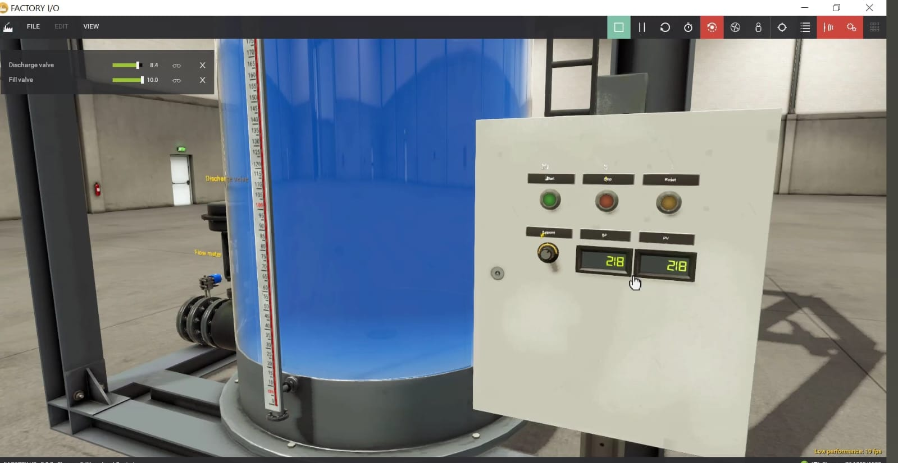
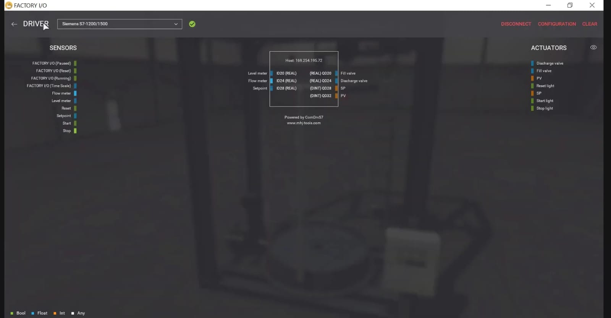
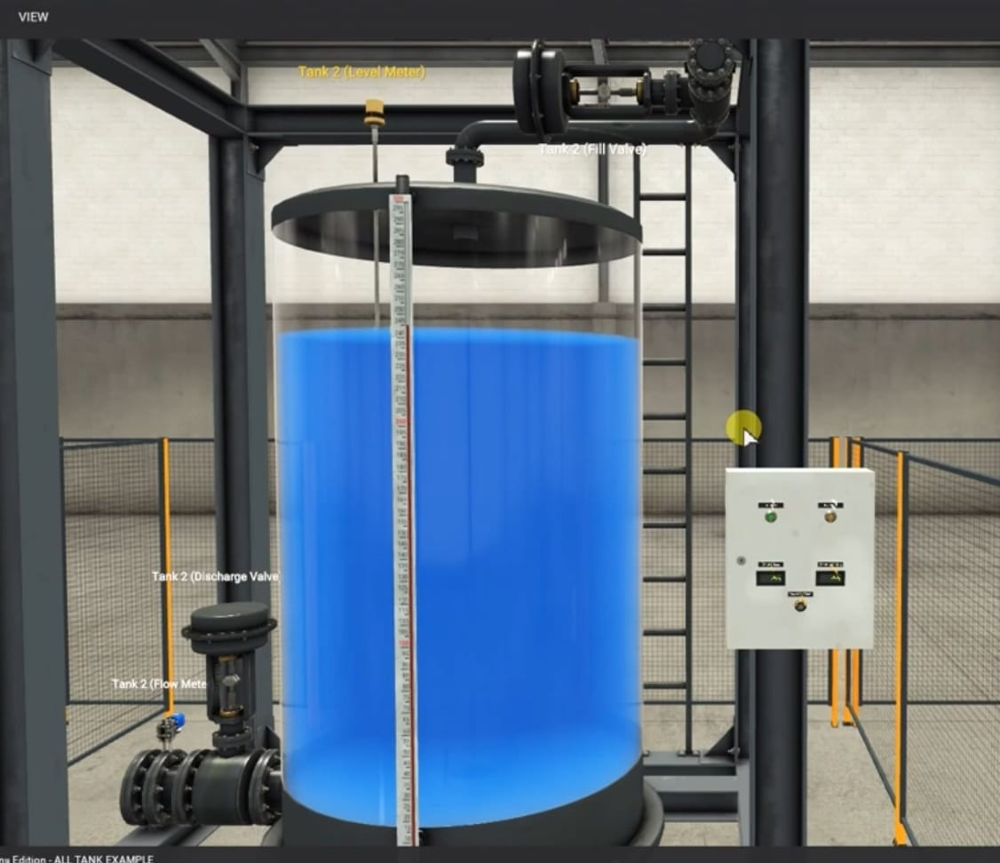
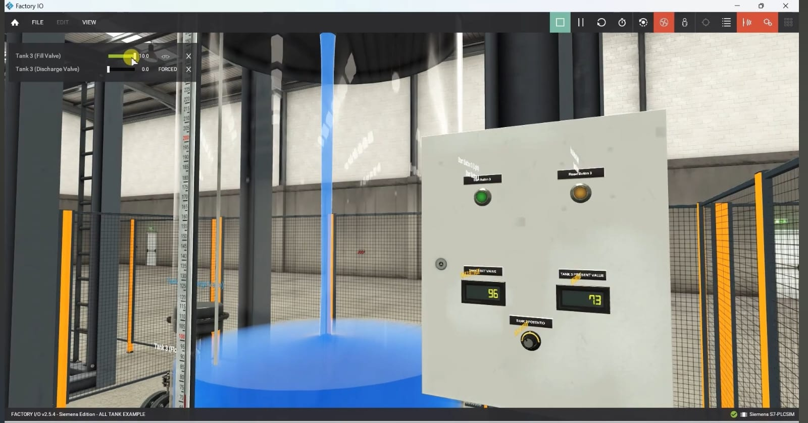

# Digital Twin for Level Process

### Real-Time Level Control using Siemens S7-1200 PLC, TIA Portal, Factory I/O and PID Compact
<p align="center">
  
</p>


> [!NOTE]
> ## 🚀 Project Highlights
>
> - Digital Twin implementation for a real-time industrial level process.
> - Siemens S7-1200 PLC with PID Compact controller.
> - Factory I/O based virtual industrial plant.
> - Industrial Ethernet communication.
> - Closed-loop PID level control.
> - Virtual commissioning using Industry 4.0 concepts.


## 📑 Table of Contents

- [Project Overview](#project-overview)
- [My Contribution](#my-contribution)
- [System Architecture](#system-architecture)
- [Working Principle](#working-principle)
- [Hardware & Software](#hardware--software-used)
- [PLC I/O Mapping](#plc-io-mapping)
- [Project Gallery](#project-gallery)
- [Results](#results)
- [Future Improvements](#future-improvements)
- [Acknowledgement](#acknowledgement)
  
## 📌 Project Overview

This project demonstrates the implementation of a **Digital Twin for a real-time industrial level control process** using **Siemens S7-1200 PLC**, **TIA Portal**, and **Factory I/O**.

A virtual level control process available in Factory I/O was configured and synchronized with a Siemens S7-1200 PLC through **Industrial Ethernet communication**. The **PID Compact Technology Object** was configured and tuned to maintain the desired liquid level by continuously comparing the **Set Point (SP)** and **Process Variable (PV)**.

The project demonstrates practical concepts of **Industrial Automation**, **Digital Twin Technology**, **Closed-Loop Process Control**, **Virtual Commissioning**, and **Industry 4.0**.
## 👨‍💻 My Contribution

This project was developed using a Siemens/Factory I/O sample application as the foundation and enhanced through PLC configuration, PID implementation, Industrial Ethernet communication, testing, and system validation.

### My contributions include

- Configured the Siemens S7-1200 PLC project in TIA Portal.
- Configured and tuned the PID Compact Technology Object.
- Established Industrial Ethernet communication between TIA Portal and Factory I/O.
- Configured Process Variable (PV), Set Point (SP), and controller parameters.
- Performed controller tuning and closed-loop performance validation.
- Analysed system behaviour under different operating conditions.
- Documented the implementation and project outcomes.
 ## 🎯 Objectives

- Develop a Digital Twin of an industrial level process.
- Implement PID-based closed-loop level control.
- Integrate Siemens S7-1200 PLC with Factory I/O.
- Configure Industrial Ethernet communication.
- Monitor and validate real-time process behaviour.
- Demonstrate virtual commissioning concepts.
  ## 🛠 Hardware Used

- Siemens S7-1200 PLC
- PLC Trainer Kit
- Ethernet Communication Interface
- Personal Computer
  ## 💻 Software Used

- Siemens TIA Portal
- Factory I/O
- Siemens PLCSIM
- PID Compact Technology Object
  ## ⚙ Technologies Used


  # 🏗️ System Architecture

```text
                   ┌───────────────────────────┐
                   │      Siemens TIA Portal   │
                   │ PLC Programming & PID     │
                   │ Compact Configuration     │
                   └─────────────┬─────────────┘
                                 │
                         Download Program
                                 │
                                 ▼
                   ┌───────────────────────────┐
                   │    Siemens S7-1200 PLC    │
                   │     PID Compact Block     │
                   └─────────────┬─────────────┘
                                 │
                   Industrial Ethernet (TCP/IP)
                                 │
                                 ▼
                   ┌───────────────────────────┐
                   │        Factory I/O        │
                   │ Virtual Level Process     │
                   │ Tank • Fill Valve • PV    │
                   └─────────────┬─────────────┘
                                 ▲
                                 │
                       Process Variable (PV)
                                 │
                                 └────────────── Feedback Loop
```
# 🔄 Project Workflow

```text
Start
   │
   ▼
Set Desired Level (SP)
   │
   ▼
TIA Portal downloads PLC Program
   │
   ▼
PLC Reads Level Sensor (PV)
   │
   ▼
PID Compact Calculates Output
   │
   ▼
Control Fill Valve Opening
   │
   ▼
Factory I/O Tank Level Changes
   │
   ▼
Updated PV Sent Back to PLC
   │
   ▼
Continuous Closed Loop Control
```
## ⚙️ Working Principle

The Digital Twin system simulates a real-time industrial liquid level control process by integrating **Factory I/O**, **Siemens S7-1200 PLC**, and **TIA Portal**.

1. The virtual tank process is created in **Factory I/O**, where a level sensor continuously measures the liquid level and provides the **Process Variable (PV)**.

2. The desired liquid level is entered as the **Set Point (SP)** through the operator interface.

3. Factory I/O exchanges real-time process data with the **Siemens S7-1200 PLC** using **Industrial Ethernet communication**.

4. Inside **TIA Portal**, the **PID Compact Technology Object** continuously compares the Process Variable (PV) with the Set Point (SP).

5. Based on the calculated control error, the PID controller automatically adjusts the opening of the **Fill Valve** to maintain the desired liquid level.

6. The updated valve position is transmitted back to Factory I/O, where the virtual process responds immediately, creating a closed-loop feedback system.

7. The Process Variable continuously follows the Set Point, demonstrating stable real-time level control and Digital Twin synchronization.

This closed-loop implementation enables real-time monitoring, controller tuning, process validation, and virtual commissioning without requiring a physical industrial plant.
## ✨ Key Features

- Digital Twin Implementation
- PID-Based Closed Loop Level Control
- Siemens S7-1200 PLC Programming
- Factory I/O Virtual Process Simulation
- Industrial Ethernet Communication
- Real-Time Process Monitoring
- Virtual Commissioning
- Industry 4.0 Demonstration
  ## 📂 Repository Structure

```text
Digital-Twin-for-Level-Process
│
├── README.md
├── LICENSE
│
└── docs
    └── images
        ├── digital-twin-demo.png
        ├── pid-monitoring.png
        ├── tank-level-control.png
        ├── driver-configuration.png
        ├── tank2-overview.png
        ├── system-overview.png
        └── tank3-overview.png
```
# 📸 Project Gallery

| Digital Twin Demonstration | PID Compact Monitoring |
|:--------------------------:|:----------------------:|
|  |  |
| *Real-time synchronization between TIA Portal and Factory I/O* | *PID Compact tuning and process response* |

| Factory I/O Tank Level Control | PLC Communication Configuration |
|:------------------------------:|:-------------------------------:|
|  |  |
| *Tank level with synchronized SP and PV* | *Industrial Ethernet communication mapping* |

| Tank 2 Simulation | Overall Plant View |
|:-----------------:|:-----------------:|
|  |  |
| *Digital Twin representation of Tank 2* | *Complete Factory I/O process setup* |

| Tank 3 Simulation | |
|:-----------------:|:--:|
|  | |
| *Digital Twin representation of Tank 3* | |
## 📈 Performance Highlights

| Parameter | Description |
|-----------|-------------|
| PLC | Siemens S7-1200 |
| Controller | PID Compact |
| Development Software | Siemens TIA Portal |
| Simulation Platform | Factory I/O |
| Communication | Industrial Ethernet |
| Process | Closed Loop Level Control |
| Feedback | Process Variable (PV) |
| Control Input | Set Point (SP) |
## 📊 Results

- Successfully implemented a Digital Twin for a real-time industrial level process.
- Established reliable communication between Siemens S7-1200 PLC and Factory I/O.
- Configured and validated PID Compact for stable level control.
- Achieved synchronization between Process Variable (PV) and Set Point (SP).
- Demonstrated virtual commissioning using industrial automation tools.
  ## 🧠 Skills Demonstrated

- PLC Programming
- PID Control
- Industrial Automation
- Factory I/O Simulation
- Industrial Ethernet Communication
- Digital Twin Implementation
- Process Monitoring
- Virtual Commissioning
- TIA Portal Configuration
  ## 🧠 Engineering Concepts Applied

- Digital Twin
- Closed Loop Process Control
- PID Control
- PLC Programming
- Industrial Automation
- Industrial Ethernet
- Virtual Commissioning
- Process Instrumentation
- Industry 4.0
  ## 🚀 Future Scope

- SCADA Integration
- Web HMI Development
- Cloud-Based Digital Twin
- IIoT Connectivity
- AI-Based Predictive Maintenance
- Multi-Tank Process Automation
- Industrial Data Analytics
  ## 📌 Project Status

| Item | Status |
|------|--------|
| Project | Completed |
| PLC | Siemens S7-1200 |
| Development Tool | TIA Portal |
| Simulation | Factory I/O |
| Controller | PID Compact |
| Academic Year | 2026 |

## 👨‍💻 Author

**Kishore Kumar A**

Final-Year Electronics and Instrumentation Engineering Student

Madras Institute of Technology (MIT Campus)

Anna University, Chennai
## 🔗 Connect with Me

- GitHub: https://github.com/KishoreKumarA13
- LinkedIn: https://www.linkedin.com/in/YOUR-LINKEDIN/
  ---

If you found this project useful, please consider ⭐ starring the repository.

## 🙏 Acknowledgement

This project was developed as part of my academic Digital Twin coursework.

The implementation was based on a Siemens TIA Portal and Factory I/O sample project, which I further studied, configured, modified, and enhanced to better understand Industrial Automation, Digital Twin concepts, PLC programming, and PID-based level control.

I sincerely thank my faculty members for their continuous guidance and support throughout the project.
